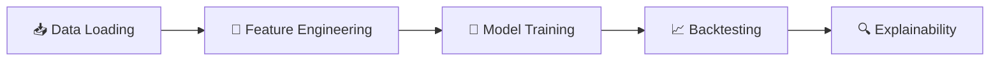

# 📊 MOEX Scanner — Volatility Forecasting System

<div align="center">


**Система прогнозирования волатильности акций Московской биржи на основе машинного обучения**

[Особенности](#-особенности) •
[Архитектура](#-архитектура) •
[ML Pipeline](#-ml-pipeline) •
[Установка](#-установка) •
[Использование](#-использование) •
[Документация](#-документация)

</div>

---

## 🎯 О проекте

**MOEX Scanner** — это комплексная система для анализа и прогнозирования волатильности акций, торгуемых на Московской бирже. Проект использует современные методы машинного обучения для построения квантильных прогнозов будущей волатильности с горизонтом 5 дней.

### Ключевые возможности

- 🔮 **Прогнозирование волатильности** — квантильная регрессия (16%, 50%, 84%) для оценки неопределённости
- 📈 **30 тикеров MOEX** — голубые фишки и ликвидные акции второго эшелона  
- 🧠 **Единая глобальная модель** — одна модель учитывает специфику всех секторов
- 📊 **Полный backtesting pipeline** — реалистичная симуляция с комиссией и slippage
- 🔍 **Explainability** — SHAP-анализ для интерпретации решений модели

---

## 🏗 Архитектура

```
MOEXScanner/
├── ML/                          # 🧠 Machine Learning Pipeline
│   ├── scripts/                 # 📜 Исполняемые скрипты
│   │   ├── run_full_pipeline.py    # Полный pipeline
│   │   ├── validate_model.py       # Валидация модели
│   │   └── compare_models.py       # Сравнение моделей
│   │
│   ├── notebooks/               # 📓 Jupyter ноутбуки (исследования)
│   │   ├── 01_data_loading.ipynb
│   │   └── plots.ipynb
│   │
│   ├── 02_feature_engineering/  # 🔬 Исследование признаков
│   ├── 03_models/               # 🤖 Модели (notebooks + production)
│   │   ├── train_global_model.py   # Обучение
│   │   └── inference.py            # Прогнозирование
│   ├── 04_backtesting/          # 📈 Бэктестинг
│   ├── 05_explainability/       # 🔍 Объяснимость
│   ├── 06_utils/                # 🛠️ Утилиты
│   │
│   ├── features/                # ⚙️ Production: генерация признаков
│   │   ├── feature_builder.py      # Главный модуль
│   │   ├── volatility_features.py
│   │   ├── volume_features.py
│   │   ├── market_features.py
│   │   ├── trend_features.py
│   │   ├── calendar_features.py
│   │   ├── intraday_features.py    # H1 признаки
│   │   └── Loaders/
│   │
│   ├── models/                  # 🧠 Production: модели
│   │   └── ensemble.py             # Ансамбль LightGBM + GARCH
│   │
│   ├── config/                  # ⚙️ Конфигурация
│   │   ├── training_config.py      # Параметры обучения (ГЛАВНЫЙ!)
│   │   └── tickers_metadata.json
│   │
│   ├── data/                    # 💾 Данные
│   │   ├── MOEX_DATA/              # Исходные OHLCV (D1 + H1)
│   │   ├── processed/              # Обработанные данные
│   │   ├── processed_ml/           # ML features
│   │   ├── backtest/               # Данные для бэктеста
│   │   └── models/                 # Обученные модели
│   │
│   ├── reports/                 # 📊 Отчёты и результаты
│   │   ├── validation_report.csv
│   │   ├── feature_importance.csv
│   │   └── validation_detailed.csv
│   │
│   ├── docs/                    # 📚 Документация
│   │   ├── SYSTEM_STRUCTURE.md     # Полная структура
│   │   ├── SYSTEM_GUIDE.md         # Гайд по работе
│   │   ├── DEVELOPMENT_ROADMAP.md   # План разработки
│   │   └── CURRENT_STATUS.md       # Проблемы и метрики
│   │
│   └── tools/                   # 🛠️ Вспомогательные скрипты
│
├── backend/                     # 🔧 Backend API (в разработке)
└── frontend/                    # 🎨 Frontend UI (в разработке)
```

---

## 🧠 ML Pipeline

### Обзор процесса



---

### 📥 Этап 1: Data Loading

**Файл:** `ML/01_data_loading.ipynb`

Загрузка исторических OHLCV данных с MOEX и первичная предобработка.

| Операция | Описание |
|----------|----------|
| Загрузка CSV | Чтение данных из `MOEX_DATA/{TICKER}/1D/` |
| Log Returns | Расчёт логарифмических доходностей: `log(Pₜ / Pₜ₋₁)` |
| Очистка | Удаление пропусков и аномалий |
| Сохранение | Parquet формат для эффективного хранения |

**Покрытие:** 30 тикеров, дневные данные с октября 2020 г.

<details>
<summary>📋 Список тикеров</summary>

| Сектор | Тикеры |
|--------|--------|
| **Finance** | SBER, VTBR, TCSG, BSPB |
| **Oil & Gas** | GAZP, LKOH, ROSN, NVTK, TATN, SNGS |
| **Mining** | GMKN, ALRS, PLZL |
| **Metals** | CHMF, NLMK, MAGN |
| **Tech** | YNDX, OZON, VKCO |
| **Telecom** | MTSS, RTKM |
| **Retail** | MGNT, FIVE, LENT |
| **Utilities** | HYDR, IRAO |
| **Other** | AFLT, PIKK, AFKS, BELU |

</details>

---

### 🔧 Этап 2: Feature Engineering

**Директория:** `ML/features/` (production) + `ML/02_feature_engineering/` (research)

Генерация **~66 нормализованных признаков** для ML-модели.

#### Категории признаков

<table>
<tr>
<td width="50%">

**📊 Volatility Features (D1)**
```
• realized_vol_5/10/20/30/60d
• ewma_vol_10/20d
• parkinson_vol_10/20d
• garman_klass_vol_10/20d
• up_vol_20d / down_vol_20d
• vol_asymmetry_20d
• vol_ratio_5_20, vol_ratio_20_60
• vol_momentum_5/10d
```

**📈 Trend Features**
```
• dist_to_sma_20/50/200
• dist_to_ema_20/50
• sma_20/50_slope_norm
• momentum_10/20
• rsi_14
• trend_signal (-1/0/1)
• trend_strength
```

</td>
<td width="50%">

**📦 Volume Features**
```
• volume_zscore_20/60
• volume_ratio_20
• volume_spike (binary)
• vp_position (Volume Profile)
• vp_width_pct
• vp_above_va
```

**📅 Calendar Features**
```
• day_of_week (0-6)
• day_of_month (1-31)
• week_of_month
• is_month_end/start
• overnight_gap
• overnight_gap_zscore
```

**⏰ Intraday Features (H1)**
```
• ivr (Intraday Vol Realized)
• opm (Opening Momentum)
• vds (Vol Distribution Skew)
• pocs (POC Session Shift)
• hvc (High Volatility Count)
• irr (Intraday Range Ratio)
```

</td>
</tr>
</table>

#### Принципы нормализации

> ⚠️ **Критически важно:** ML-датасет НЕ содержит абсолютных значений цен и объёмов!

| Сырые данные | Нормализованный признак |
|--------------|------------------------|
| `close`, `SMA_20` | `dist_to_sma_20 = close / SMA - 1` |
| `volume` | `volume_zscore = (V - MA) / STD` |
| `VP POC level` | `vp_position = (close - POC) / VA_width` |

#### Метаданные тикеров

Каждый тикер обогащается метаинформацией:

```python
{
    "ticker_id": "SBER",
    "sector_id": "Finance",
    "sector_encoded": 1,        # Числовой код сектора
    "liquidity_rank": 1,        # 1 = самый ликвидный
    "is_blue_chip": 1,          # Голубая фишка
    "lot_size_log": 2.30        # log(lot_size)
}
```

---

### 🤖 Этап 3: Model Training

**Директория:** `ML/03_models/`

#### Архитектура модели

```
┌─────────────────────────────────────────────────────────────┐
│                   GLOBAL QUANTILE MODEL                      │
├─────────────────────────────────────────────────────────────┤
│  Input: Все тикеры объединены в единый DataFrame            │
│  ↓                                                           │
│  Feature Engineering: ~66 нормализованных признаков (D1 + H1)│
│  ↓                                                           │
│  ┌─────────────┐  ┌─────────────┐  ┌─────────────┐          │
│  │ LightGBM    │  │ LightGBM    │  │ LightGBM    │          │
│  │ α = 0.16    │  │ α = 0.50    │  │ α = 0.84    │          │
│  │ (Lower 1σ)  │  │ (Median)    │  │ (Upper 1σ)  │          │
│  └──────┬──────┘  └──────┬──────┘  └──────┬──────┘          │
│         │                │                │                  │
│         └────────────────┼────────────────┘                  │
│                          ↓                                   │
│              [pred_q16, pred_q50, pred_q84]                  │
│                   Интервальный прогноз                       │
└─────────────────────────────────────────────────────────────┘
```

#### Целевая переменная

```python
target_vol_5d = rolling_std(log_return, 5).shift(-5) * √252
```

> Реализованная волатильность на горизонте 5 дней, смещённая в будущее для предсказания.

#### Гиперпараметры LightGBM

```python
LGBM_PARAMS = {
    'boosting_type': 'gbdt',
    'objective': 'quantile',
    'num_leaves': 63,
    'learning_rate': 0.05,
    'feature_fraction': 0.8,
    'bagging_fraction': 0.8,
    'lambda_l1': 0.1,
    'lambda_l2': 0.1,
    'min_child_samples': 20
}
```

#### Train/Test Split

```
┌──────────────────────────────────────────────────────────┐
│ 2020-10  ─────────────────────────────────────  2025-10  │
│                                                          │
│ ████████████████████████████████████░░░░░░░░░░░░░░░░░░░ │
│ │←────── TRAIN (до 2024-06-01) ───────→│←── TEST ──→│   │
│                                                          │
│ Строгий временной split без shuffle!                     │
│ Соотношение: 70% / 30%                                   │
└──────────────────────────────────────────────────────────┘
```

**Текущая конфигурация:**
- Train: 25,528 записей (до 2024-06-01)
- Test: 11,533 записей (после 2024-06-01)
- Cutoff: `2024-06-01` (пресет MORE_TRAIN)

#### Sample Weighting

Более ликвидные активы получают больший вес:

```python
weight = 1 / log(liquidity_rank + 2)
```

---

### 📈 Этап 4: Backtesting

**Директория:** `ML/04_backtesting/`

#### Торговая стратегия: Mean Reversion in Trend

```python
# LONG: Восходящий тренд + откат к нижней границе
signal_long = (trend == 1) & (low <= lower_band)

# SHORT: Нисходящий тренд + рост к верхней границе  
signal_short = (trend == -1) & (high >= upper_band)
```

#### Денормализация прогнозов

```python
upper_band = close × (1 + pred_q84)
lower_band = close × (1 - pred_q84)
take_profit = close × (1 + pred_q50 × 0.5)
```

#### Параметры симуляции

| Параметр | Значение |
|----------|----------|
| Комиссия | 0.1% |
| Slippage | 0.05% |
| Stop Loss (Long) | lower_band × 0.98 |
| Stop Loss (Short) | upper_band × 1.02 |

#### Метрики производительности

- **Sharpe Ratio** — годовая доходность / волатильность
- **Max Drawdown** — максимальная просадка
- **Win Rate** — доля прибыльных сделок
- **Profit Factor** — отношение прибыли к убыткам
- **Expectancy** — средняя прибыль на сделку

---

### 🔍 Этап 5: Explainability

**Директория:** `ML/05_explainability/`

#### SHAP Analysis

Интерпретация решений модели через SHAP values:

```python
explainer = shap.TreeExplainer(model)
shap_values = explainer.shap_values(X_test)
shap.summary_plot(shap_values, X_test)
```

#### Feature Importance (Gain)

Топ-10 признаков по важности (gain):

```
parkinson_vol_10d    ████████████████████████████████  4875.4
ewma_vol_20d         ███████████████████████████       3347.7
ticker_id            ███████████████████████           2338.0
ewma_vol_10d         ████████████                      1223.0
index_vol_30d        ███████████                       1020.0
parkinson_vol_20d    █████████                          844.6
index_vol_60d        █████████                          833.5
gk_vol_20d           █████████                         799.4
gk_vol_10d           ██████                             577.0
dist_to_ema_20       ██████                             552.0
```

**Наблюдения:**
- Волатильность (Parkinson, EWMA) — ключевые признаки
- `ticker_id` на 3 месте — модель учитывает специфику тикеров
- Рыночные признаки (index_vol) важны для контекста
- H1 признаки (ivr, hvc) присутствуют, но с меньшей важностью

---

## 🔧 Backend

<div align="center">


</div>

> 🚧 **Backend API находится в активной разработке**
> 
> Планируется:
> - REST API для получения прогнозов
> - WebSocket для real-time обновлений
> - Интеграция с MOEX ISS API
> - Кэширование и оптимизация

---

## 🎨 Frontend

<div align="center">


</div>

> 🚧 **Frontend UI находится в активной разработке**
> 
> Планируется:
> - Dashboard с обзором рынка
> - Интерактивные графики волатильности
> - Визуализация торговых сигналов
> - Мониторинг портфеля

---

## 🚀 Установка

### Требования

- Python 3.12+
- Windows / Linux / macOS

### Быстрый старт

```bash
# 1. Клонирование репозитория
git clone https://github.com/your-username/MOEXScanner.git
cd MOEXScanner/ML

# 2. Создание виртуального окружения
python -m venv venv

# 3. Активация (Windows PowerShell)
.\venv\Scripts\Activate.ps1

# 4. Установка зависимостей
pip install -r requirements.txt

# 5. Проверка установки
python test_setup.py
```

### Зависимости

```
pandas>=2.0.0
numpy>=1.24.0
scikit-learn>=1.3.0
lightgbm>=4.0.0
matplotlib>=3.7.0
seaborn>=0.12.0
jupyter>=1.0.0
pyarrow>=12.0.0
```

<details>
<summary>Опциональные зависимости</summary>

```
arch>=6.0.0        # Для GARCH моделей
shap>=0.42.0       # Для SHAP анализа
requests>=2.28.0   # Для загрузки данных с MOEX
```

</details>

---

## 📖 Использование

### Запуск полного pipeline

```powershell
cd ML
venv\Scripts\activate

# Полный цикл: Features → Training → Inference
python scripts/run_full_pipeline.py

# Только обучение (features готовы)
python scripts/run_full_pipeline.py --skip-features --preset MORE_TRAIN

# Только инференс
python scripts/run_full_pipeline.py --skip-features --skip-training --ticker SBER
```

### Валидация модели

```powershell
python scripts/validate_model.py
```

### Сравнение моделей

```powershell
# Сохраните старый отчёт
copy reports\validation_report.csv reports\validation_report_baseline.csv

# Обучите новую модель
python scripts/run_full_pipeline.py --skip-features --preset REGULARIZED

# Сравните
python scripts/compare_models.py
```

### Использование модели для прогноза

```python
from inference import GlobalQuantileModel

# Загрузка модели
model = GlobalQuantileModel(use_ensemble=True)
model.load_models()

# Прогноз
predictions = model.predict_ensemble(new_data)
# predictions: ['pred_q16', 'pred_q50', 'pred_q84', 'interval_width', ...]
```

### Настройка параметров

Все параметры обучения настраиваются в **одном файле**: `ML/config/training_config.py`

```python
# Выберите пресет или измените параметры
ACTIVE_PRESET = 'MORE_TRAIN'  # или BASELINE, REGULARIZED, NO_TICKER

# Или измените напрямую:
TRAIN_CUTOFF_DATE = '2024-06-01'
LGBM_PARAMS = {
    'num_leaves': 63,
    'learning_rate': 0.05,
    'lambda_l1': 0.5,  # Регуляризация
    ...
}
```

---

## 📚 Документация

| Документ | Описание |
|----------|----------|
| [ML/docs/README.md](ML/docs/README.md) | Главная документация |
| [ML/docs/SYSTEM_STRUCTURE.md](ML/docs/SYSTEM_STRUCTURE.md) | Полная структура системы |
| [ML/docs/SYSTEM_GUIDE.md](ML/docs/SYSTEM_GUIDE.md) | Гайд по работе системы |
| [ML/docs/DEVELOPMENT_ROADMAP.md](ML/docs/DEVELOPMENT_ROADMAP.md) | План разработки |
| [ML/docs/CURRENT_STATUS.md](ML/docs/CURRENT_STATUS.md) | Текущие проблемы и метрики |
| [ML/scripts/README.md](ML/scripts/README.md) | Документация скриптов |

---

## 📊 Результаты и метрики

<div align="center">


</div>

### Покрытие данных

| Метрика | Значение |
|---------|----------|
| Тикеров | 30 |
| Период | Октябрь 2020 — Декабрь 2025 |
| Таймфрейм | Daily (1D) + Hourly (1H) |
| Записей | ~1,300 на тикер (D1) |
| Признаков | **66** (D1 + H1) |

### Производительность модели

**Конфигурация:** MORE_TRAIN (70/30 split, cutoff: 2024-06-01)

#### Метрики на тестовой выборке

| Метрика | Значение | Статус | Цель |
|---------|----------|--------|------|
| **Coverage 68%** | 66.0% | ✅ | 68% ± 2% |
| **Interval Width** | 0.270 | ⚠️ | < 0.25 |
| **MAE (Median)** | 0.120 | ⚠️ | < 0.10 |
| **Quantile Loss (q16)** | 0.029 | ✅ | < 0.03 |
| **Quantile Loss (q50)** | 0.060 | ⚠️ | < 0.05 |
| **Quantile Loss (q84)** | 0.049 | ✅ | < 0.05 |

**Train/Test Split:**
- Train: 25,528 записей (70%)
- Test: 11,533 записей (30%)

#### Метрики валидации (на всех данных)

| Метрика | Значение | Статус |
|---------|----------|--------|
| **Correlation** | 0.489 | ❌ Низкая |
| **MAE** | 0.117 | ⚠️ Средне |
| **RMSE** | 0.280 | ⚠️ Высокая |
| **MAPE** | 48.8% | ❌ Очень высокая |
| **Bias** | +4.14% | ⚠️ Завышает прогнозы |

**Покрытие интервала:**
- Ожидаемое: 68.0%
- Фактическое: 68.3%
- Ошибка калибровки: **0.3%** ✅

#### Лучшие тикеры (по корреляции)

| Тикер | Coverage | MAE | Correlation |
|-------|----------|-----|-------------|
| **SBER** | 66.1% | 0.095 | **0.659** |
| **AFLT** | 69.6% | 0.118 | **0.648** |
| **LKOH** | 68.4% | 0.091 | **0.640** |
| **MTSS** | 70.9% | 0.100 | **0.638** |
| **OZON** | 68.3% | 0.164 | **0.632** |

#### Проблемные тикеры

| Тикер | Correlation | Рекомендация |
|-------|-------------|--------------|
| FIVE | 0.077 | Исключить из обучения |
| BELU | 0.241 | Исключить из обучения |
| YNDX | 0.343 | Исключить из обучения |
| LENT | 0.427 | Исключить из обучения |

**Подробнее:** [ML/docs/CURRENT_STATUS.md](ML/docs/CURRENT_STATUS.md)

---

## 🛠 Технологии

<div align="center">

| Категория | Технологии |
|-----------|------------|
| **ML Framework** | LightGBM, scikit-learn |
| **Data Processing** | Pandas, NumPy, PyArrow |
| **Visualization** | Matplotlib, Seaborn |
| **Development** | Jupyter Lab, VS Code |
| **Time Series** | arch (GARCH) |
| **Explainability** | SHAP |

</div>

---

## 📝 Лицензия

Этот проект распространяется под лицензией MIT. См. файл [LICENSE](LICENSE) для подробностей.

---

## 🤝 Контрибьюция

Contributions приветствуются! Пожалуйста:

1. Fork репозитория
2. Создайте feature branch (`git checkout -b feature/AmazingFeature`)
3. Commit изменений (`git commit -m 'Add AmazingFeature'`)
4. Push в branch (`git push origin feature/AmazingFeature`)
5. Откройте Pull Request

---

<div align="center">

**⭐ Если проект был полезен, поставьте звезду!**

Made with ❤️ for MOEX traders

</div>
