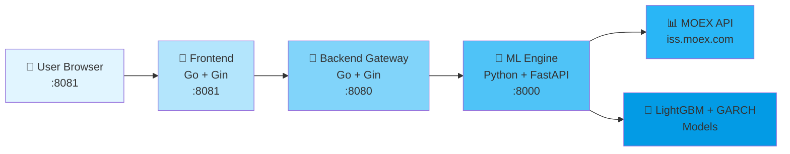
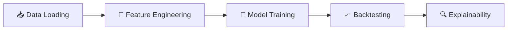

# 📊 MOEX Scanner — Volatility Forecasting System

<div align="center">


**Microservices система прогнозирования волатильности акций Московской биржи**  
**ML Engine (Python + LightGBM + GARCH) + API Gateway (Go) + Web UI (Go + Gin)**

[Особенности](#-особенности) •
[Архитектура](#-архитектура) •
[ML Pipeline](#-ml-pipeline) •
[Установка](#-установка) •
[Использование](#-использование) •
[Документация](#-документация)

</div>

---

## 🎯 О проекте

**MOEX Scanner** — это комплексная система для анализа и прогнозирования волатильности акций, торгуемых на Московской бирже. Проект использует современные методы машинного обучения для построения квантильных прогнозов будущей волатильности с горизонтом 5 дней.

### Ключевые возможности

- 🔮 **Прогнозирование волатильности** — квантильная регрессия (16%, 50%, 84%) для оценки неопределённости
- 📈 **30 тикеров MOEX** — голубые фишки и ликвидные акции второго эшелона  
- 🧠 **Единая глобальная модель** — одна модель учитывает специфику всех секторов
- 📊 **Полный backtesting pipeline** — реалистичная симуляция с комиссией и slippage
- 🔍 **Explainability** — SHAP-анализ для интерпретации решений модели

---

## 🏗 Архитектура

```
MOEXScanner/
├── ML/                          # 🧠 Machine Learning Pipeline
│   ├── scripts/                 # 📜 Исполняемые скрипты
│   │   ├── run_full_pipeline.py    # Полный pipeline
│   │   ├── validate_model.py       # Валидация модели
│   │   └── compare_models.py       # Сравнение моделей
│   │
│   ├── notebooks/               # 📓 Jupyter ноутбуки (исследования)
│   │   ├── 01_data_loading.ipynb
│   │   └── plots.ipynb
│   │
│   ├── 02_feature_engineering/  # 🔬 Исследование признаков
│   ├── 03_models/               # 🤖 Модели (notebooks + production)
│   │   ├── train_global_model.py   # Обучение
│   │   └── inference.py            # Прогнозирование
│   ├── 04_backtesting/          # 📈 Бэктестинг
│   ├── 05_explainability/       # 🔍 Объяснимость
│   ├── 06_utils/                # 🛠️ Утилиты
│   │
│   ├── features/                # ⚙️ Production: генерация признаков
│   │   ├── feature_builder.py      # Главный модуль
│   │   ├── volatility_features.py
│   │   ├── volume_features.py
│   │   ├── market_features.py
│   │   ├── trend_features.py
│   │   ├── calendar_features.py
│   │   ├── intraday_features.py    # H1 признаки
│   │   └── Loaders/
│   │
│   ├── models/                  # 🧠 Production: модели
│   │   └── ensemble.py             # Ансамбль LightGBM + GARCH
│   │
│   ├── config/                  # ⚙️ Конфигурация
│   │   ├── training_config.py      # Параметры обучения (ГЛАВНЫЙ!)
│   │   └── tickers_metadata.json
│   │
│   ├── data/                    # 💾 Данные
│   │   ├── MOEX_DATA/              # Исходные OHLCV (D1 + H1)
│   │   ├── processed/              # Обработанные данные
│   │   ├── processed_ml/           # ML features
│   │   ├── backtest/               # Данные для бэктеста
│   │   └── models/                 # Обученные модели
│   │
│   ├── reports/                 # 📊 Отчёты и результаты
│   │   ├── validation_report.csv
│   │   ├── feature_importance.csv
│   │   └── validation_detailed.csv
│   │
│   ├── docs/                    # 📚 Документация
│   │   ├── SYSTEM_STRUCTURE.md     # Полная структура
│   │   ├── SYSTEM_GUIDE.md         # Гайд по работе
│   │   ├── DEVELOPMENT_ROADMAP.md   # План разработки
│   │   └── CURRENT_STATUS.md       # Проблемы и метрики
│   │
│   └── tools/                   # 🛠️ Вспомогательные скрипты
│
├── backend/                     # 🔧 Backend API Gateway (✅ Production)
└── front/                       # 🎨 Frontend UI (✅ Production)
```

### Microservices Flow


```mermaid
graph LR
    A[👤 User Browser<br/>:8081] --> B[🎨 Frontend<br/>Go + Gin<br/>:8081]
    B --> C[🔧 Backend Gateway<br/>Go + Gin<br/>:8080]
    C --> D[🧠 ML Engine<br/>Python + FastAPI<br/>:8000]
    D --> E[📊 MOEX API<br/>iss.moex.com]
    D --> F[🤖 LightGBM + GARCH<br/>Models]
    
    style A fill:#e1f5ff
    style B fill:#b3e5fc
    style C fill:#81d4fa
    style D fill:#4fc3f7
    style E fill:#29b6f6
    style F fill:#039be5
```

---

## 🧠 ML Pipeline

### Обзор процесса


```mermaid
graph LR
    A[📥 Data Loading] --> B[🔧 Feature Engineering]
    B --> C[🤖 Model Training]
    C --> D[📈 Backtesting]
    D --> E[🔍 Explainability]
```

---

### 📥 Этап 1: Data Loading

**Файл:** `ML/01_data_loading.ipynb`

Загрузка исторических OHLCV данных с MOEX и первичная предобработка.

| Операция | Описание |
|----------|----------|
| Загрузка CSV | Чтение данных из `MOEX_DATA/{TICKER}/1D/` |
| Log Returns | Расчёт логарифмических доходностей: `log(Pₜ / Pₜ₋₁)` |
| Очистка | Удаление пропусков и аномалий |
| Сохранение | Parquet формат для эффективного хранения |

**Покрытие:** 30 тикеров, дневные данные с октября 2020 г.

<details>
<summary>📋 Список тикеров</summary>

| Сектор | Тикеры |
|--------|--------|
| **Finance** | SBER, VTBR, TCSG, BSPB |
| **Oil & Gas** | GAZP, LKOH, ROSN, NVTK, TATN, SNGS |
| **Mining** | GMKN, ALRS, PLZL |
| **Metals** | CHMF, NLMK, MAGN |
| **Tech** | YNDX, OZON, VKCO |
| **Telecom** | MTSS, RTKM |
| **Retail** | MGNT, FIVE, LENT |
| **Utilities** | HYDR, IRAO |
| **Other** | AFLT, PIKK, AFKS, BELU |

</details>

---

### 🔧 Этап 2: Feature Engineering

**Директория:** `ML/features/` (production) + `ML/02_feature_engineering/` (research)

Генерация **~66 нормализованных признаков** для ML-модели.

#### Категории признаков

<table>
<tr>
<td width="50%">

**📊 Volatility Features (D1)**
```
• realized_vol_5/10/20/30/60d
• ewma_vol_10/20d
• parkinson_vol_10/20d
• garman_klass_vol_10/20d
• up_vol_20d / down_vol_20d
• vol_asymmetry_20d
• vol_ratio_5_20, vol_ratio_20_60
• vol_momentum_5/10d
```

**📈 Trend Features**
```
• dist_to_sma_20/50/200
• dist_to_ema_20/50
• sma_20/50_slope_norm
• momentum_10/20
• rsi_14
• trend_signal (-1/0/1)
• trend_strength
```

</td>
<td width="50%">

**📦 Volume Features**
```
• volume_zscore_20/60
• volume_ratio_20
• volume_spike (binary)
• vp_position (Volume Profile)
• vp_width_pct
• vp_above_va
```

**📅 Calendar Features**
```
• day_of_week (0-6)
• day_of_month (1-31)
• week_of_month
• is_month_end/start
• overnight_gap
• overnight_gap_zscore
```

**⏰ Intraday Features (H1)**
```
• ivr (Intraday Vol Realized)
• opm (Opening Momentum)
• vds (Vol Distribution Skew)
• pocs (POC Session Shift)
• hvc (High Volatility Count)
• irr (Intraday Range Ratio)
```

</td>
</tr>
</table>

#### Принципы нормализации

> ⚠️ **Критически важно:** ML-датасет НЕ содержит абсолютных значений цен и объёмов!

| Сырые данные | Нормализованный признак |
|--------------|------------------------|
| `close`, `SMA_20` | `dist_to_sma_20 = close / SMA - 1` |
| `volume` | `volume_zscore = (V - MA) / STD` |
| `VP POC level` | `vp_position = (close - POC) / VA_width` |

#### Метаданные тикеров

Каждый тикер обогащается метаинформацией:

```python
{
    "ticker_id": "SBER",
    "sector_id": "Finance",
    "sector_encoded": 1,        # Числовой код сектора
    "liquidity_rank": 1,        # 1 = самый ликвидный
    "is_blue_chip": 1,          # Голубая фишка
    "lot_size_log": 2.30        # log(lot_size)
}
```

---

### 🤖 Этап 3: Model Training

**Директория:** `ML/03_models/`

#### Архитектура модели

```
┌─────────────────────────────────────────────────────────────┐
│                   GLOBAL QUANTILE MODEL                      │
├─────────────────────────────────────────────────────────────┤
│  Input: Все тикеры объединены в единый DataFrame            │
│  ↓                                                           │
│  Feature Engineering: ~66 нормализованных признаков (D1 + H1)│
│  ↓                                                           │
│  ┌─────────────┐  ┌─────────────┐  ┌─────────────┐          │
│  │ LightGBM    │  │ LightGBM    │  │ LightGBM    │          │
│  │ α = 0.16    │  │ α = 0.50    │  │ α = 0.84    │          │
│  │ (Lower 1σ)  │  │ (Median)    │  │ (Upper 1σ)  │          │
│  └──────┬──────┘  └──────┬──────┘  └──────┬──────┘          │
│         │                │                │                  │
│         └────────────────┼────────────────┘                  │
│                          ↓                                   │
│              [pred_q16, pred_q50, pred_q84]                  │
│                   Интервальный прогноз                       │
└─────────────────────────────────────────────────────────────┘
```

#### Целевая переменная

```python
target_vol_5d = rolling_std(log_return, 5).shift(-5) * √252
```

> Реализованная волатильность на горизонте 5 дней, смещённая в будущее для предсказания.

#### Гиперпараметры LightGBM

```python
LGBM_PARAMS = {
    'boosting_type': 'gbdt',
    'objective': 'quantile',
    'num_leaves': 63,
    'learning_rate': 0.05,
    'feature_fraction': 0.8,
    'bagging_fraction': 0.8,
    'lambda_l1': 0.1,
    'lambda_l2': 0.1,
    'min_child_samples': 20
}
```

#### Train/Test Split

```
┌──────────────────────────────────────────────────────────┐
│ 2020-10  ─────────────────────────────────────  2025-10  │
│                                                          │
│ ████████████████████████████████████░░░░░░░░░░░░░░░░░░░ │
│ │←────── TRAIN (до 2024-06-01) ───────→│←── TEST ──→│   │
│                                                          │
│ Строгий временной split без shuffle!                     │
│ Соотношение: 70% / 30%                                   │
└──────────────────────────────────────────────────────────┘
```

**Текущая конфигурация:**
- Train: 25,528 записей (до 2024-06-01)
- Test: 11,533 записей (после 2024-06-01)
- Cutoff: `2024-06-01` (пресет MORE_TRAIN)

#### Sample Weighting

Более ликвидные активы получают больший вес:

```python
weight = 1 / log(liquidity_rank + 2)
```

---

### 📈 Этап 4: Backtesting

**Директория:** `ML/04_backtesting/`

#### Торговая стратегия: Mean Reversion in Trend

```python
# LONG: Восходящий тренд + откат к нижней границе
signal_long = (trend == 1) & (low <= lower_band)

# SHORT: Нисходящий тренд + рост к верхней границе  
signal_short = (trend == -1) & (high >= upper_band)
```

#### Денормализация прогнозов

```python
upper_band = close × (1 + pred_q84)
lower_band = close × (1 - pred_q84)
take_profit = close × (1 + pred_q50 × 0.5)
```

#### Параметры симуляции

| Параметр | Значение |
|----------|----------|
| Комиссия | 0.1% |
| Slippage | 0.05% |
| Stop Loss (Long) | lower_band × 0.98 |
| Stop Loss (Short) | upper_band × 1.02 |

#### Метрики производительности

- **Sharpe Ratio** — годовая доходность / волатильность
- **Max Drawdown** — максимальная просадка
- **Win Rate** — доля прибыльных сделок
- **Profit Factor** — отношение прибыли к убыткам
- **Expectancy** — средняя прибыль на сделку

---

### 🔍 Этап 5: Explainability

**Директория:** `ML/05_explainability/`

#### SHAP Analysis

Интерпретация решений модели через SHAP values:

```python
explainer = shap.TreeExplainer(model)
shap_values = explainer.shap_values(X_test)
shap.summary_plot(shap_values, X_test)
```

#### Feature Importance (Gain)

Топ-10 признаков по важности (gain):

```
parkinson_vol_10d    ████████████████████████████████  4875.4
ewma_vol_20d         ███████████████████████████       3347.7
ticker_id            ███████████████████████           2338.0
ewma_vol_10d         ████████████                      1223.0
index_vol_30d        ███████████                       1020.0
parkinson_vol_20d    █████████                          844.6
index_vol_60d        █████████                          833.5
gk_vol_20d           █████████                         799.4
gk_vol_10d           ██████                             577.0
dist_to_ema_20       ██████                             552.0
```

**Наблюдения:**
- Волатильность (Parkinson, EWMA) — ключевые признаки
- `ticker_id` на 3 месте — модель учитывает специфику тикеров
- Рыночные признаки (index_vol) важны для контекста
- H1 признаки (ivr, hvc) присутствуют, но с меньшей важностью

---

## 🔧 Backend (Production Ready)

Бэкенд состоит из двух уровней: **Go API Gateway** и **Python ML Engine**.

### Go Backend Gateway (`backend/`)

**Статус:** ✅ Production  
**Технологии:** Go + Gin  
**Порт:** 8080  
**Назначение:** Data Gateway — загружает исторические данные с MOEX (365 дней) и проксирует запросы к ML Engine.

- **Основные файлы**
  - `back.go` — точка входа, инициализирует `gin.Engine`, регистрирует роуты через `api_contracts.SetupRoutes`.
  - `api_contracts/contracts.go` — описание маршрутов.
  - `api_contracts/structs.go` — структуры запросов/ответов.
  - `api_contracts/handlers.go` — бизнес‑логика эндпоинтов.
  - `src/moex_cals.go` — обращение к MOEX ISS API.
  - `src/ai_cals.go` — вызов внешней LLM (DeepSeek через OpenRouter).
  - `src/db/db.go` — подключение к PostgreSQL и создание таблиц.

- **Маршруты (`api_contracts.SetupRoutes`)**
  - `GET /health` → `HealthHandler.CheckHealth`
  - `GET /features/:ticker` → `FeaturesHandler.GetFeatures` (пока заглушка)
  - `POST /predict` → `PredictionHandler.Predict`
  - `POST /backtest` → `BacktestHandler.RunBacktest` (TODO)
  - `POST /update_data` → `DataHandler.UpdateData` (TODO)

- **Структуры запросов и ответов (упрощённо)**  
  **Запрос на прогноз:**
  ```go
  type PredictionRequest struct {
      Ticker      string `json:"ticker" binding:"required"`
      Timeframe   string `json:"timeframe" binding:"required"`        // "D"
      Horizon     int    `json:"horizon" binding:"required,min=1,max=30"`
      Date        string `json:"date" binding:"required"`             // "YYYY-MM-DD"
      IncludeSHAP bool   `json:"include_shap"`                         // пока не используется
  }
  ```

  **Ответ AI/ML‑сервиса (`PredictionResponse`):**
  ```go
  type PredictedVolatility struct {
      Median      float64 `json:"median"`
      Lower1Sigma float64 `json:"lower_1sigma"`
      Upper1Sigma float64 `json:"upper_1sigma"`
      Lower2Sigma float64 `json:"lower_2sigma"`
      Upper2Sigma float64 `json:"upper_2sigma"`
  }

  type Trend struct {
      Direction  string  `json:"direction"`   // "uptrend"/"downtrend"/"sideways"
      Confidence string  `json:"confidence"`  // "high"/"medium"/"low"
      Strength   float64 `json:"strength"`    // 0..1
  }

  type Channel struct {
      Upper2Sigma  float64 `json:"upper_2sigma"`
      Upper1Sigma  float64 `json:"upper_1sigma"`
      CurrentPrice float64 `json:"current_price"`
      Lower1Sigma  float64 `json:"lower_1sigma"`
      Lower2Sigma  float64 `json:"lower_2sigma"`
  }

  type TradingSignal struct {
      Action       string  `json:"action"`        // "BUY"/"SELL"/"HOLD"/"WAIT"
      Entry        float64 `json:"entry"`
      Target       float64 `json:"target"`
      StopLoss     float64 `json:"stop_loss"`
      PositionSize float64 `json:"position_size"` // 0..1
      Reason       string  `json:"reason"`
  }

  type TailRisk struct {
      Warning      bool     `json:"warning"`
      Probability  float64  `json:"probability"`   // 0..1
      ExpectedLoss *float64 `json:"expected_loss"` // может быть null
  }

  type Feature struct {
      Name         string  `json:"name"`
      Value        float64 `json:"value"`
      Contribution float64 `json:"contribution"`
  }

  type Explanation struct {
      Text        string    `json:"text"`
      TopFeatures []Feature `json:"top_features"`
  }

  type VolumeContext struct {
      Zscore        float64 `json:"zscore"`
      SpikeDetected bool    `json:"spike_detected"`
      PocDistance   float64 `json:"poc_distance"`
      VaPosition    string  `json:"va_position"` // "inside/above/below"
  }

  type PredictionResponse struct {
      Ticker              string              `json:"ticker"`
      Horizon             int                 `json:"horizon"`
      PredictedVolatility PredictedVolatility `json:"predicted_volatility"`
      Confidence          float64             `json:"confidence"`       // 0..1
      Trend               Trend               `json:"trend"`
      Channel             Channel             `json:"channel"`
      TradingSignal       TradingSignal       `json:"trading_signal"`
      TailRisk            TailRisk            `json:"tail_risk"`
      VolumeContext       VolumeContext       `json:"volume_context"`
      Explanation         Explanation         `json:"explanation"`
  }
  ```

- **Как работает `POST /predict`**
  1. Валидирует JSON по `PredictionRequest`.
  2. Берёт дату `Date` и строит период `[Date-365d, Date]` (увеличено с 60 до 365 дней для ML-признаков).
  3. Вызывает `src.GetCandles(ticker, from, till, interval=24)` → HTTP к `https://iss.moex.com/.../candles.json`.
  4. Формирует JSON payload и отправляет POST на Python ML Engine (`http://127.0.0.1:8000/predict`).
  5. Получает `PredictionResponse` от ML Engine и возвращает клиенту.

### Python ML Engine (`ML/scripts/serve_model.py`)

**Статус:** ✅ Production  
**Технологии:** Python + FastAPI + LightGBM + GARCH  
**Порт:** 8000  
**Назначение:** AI Core — генерация признаков, inference, торговые сигналы, SHAP explanations.

- **Контракт ответа (Python, Pydantic)**  
  Адаптер строит своё представление прогноза, которое по смыслу совпадает с Go‑структурами, но более «Python‑friendly»:
  ```python
  class PredictedVolatility(BaseModel):
      median: float          # q50
      lower_1sigma: float    # q16
      upper_1sigma: float    # q84
      lower_2sigma: float    # q50 - 2*(q50-q16)
      upper_2sigma: float    # q50 + 2*(q84-q50)

  class Trend(BaseModel):
      direction: str         # "UP", "DOWN", "SIDE"
      confidence: str        # "HIGH", "MEDIUM", "LOW"
      strength: float        # 0.0–1.0

  class TradingSignal(BaseModel):
      action: str            # "BUY", "SELL", "HOLD", "WAIT"
      entry: float
      target: float
      stop_loss: float
      reason: str

  class TailRisk(BaseModel):
      warning: bool
      probability: float
      expected_loss: float

  class FeatureContribution(BaseModel):
      name: str
      impact: str            # "positive" / "negative"
      description: str
      value: float

  class Explanation(BaseModel):
      summary: str
      top_features: List[FeatureContribution]

  class PredictionResponse(BaseModel):
      ticker: str
      date: str
      current_price: float
      volatility: PredictedVolatility
      trend: Trend
      signal: TradingSignal
      tail_risk: TailRisk
      explanation: Explanation
  ```

- **Эндпоинты FastAPI**
  - `GET /health` → `{"status": "ok", "model_loaded": true/false}`.
  - `POST /predict` → `PredictionResponse`.

- **Пайплайн внутри `POST /predict`**
  1. Принимает `{"ticker": "SBER", "horizon": 5, "candles": [...]}` от Go Backend.
  2. Строит DataFrame из свечей и генерирует **~66 признаков** через `build_dataframe()`.
  3. Загружает `GlobalQuantileModel` (ensemble: 70% LightGBM + 30% GARCH).
  4. Делает inference и получает квантили волатильности: `[pred_q16, pred_q50, pred_q84]`.
  5. Де-аннуализирует волатильность (Square Root of Time Rule) для горизонта прогноза.
  6. Строит симметричные ценовые каналы вокруг `current_price`.
  7. Генерирует **профессиональные торговые сигналы**:
     - Определяет тренд по `pred_price_median_up > current_price`
     - Рассчитывает smart entry (Limit Order на откате/ралли)
     - Устанавливает Target и Stop Loss по границам волатильности
     - Применяет фильтр Risk/Reward (>=1.2)
  8. Извлекает Volume Context (`volume_zscore`, `spike_detected`, `va_position`) из признаков.
  9. Генерирует SHAP explanation с топ-фичами.
  10. Возвращает полный `PredictionResponse` JSON.

---

## 🎨 Frontend (Production Ready)

**Статус:** ✅ Production  
**Технологии:** Go + Gin + HTML/JS + Chart.js  
**Порт:** 8081  
**Назначение:** User Interface — чат-интерфейс с AI Trading Assistant, визуализация прогнозов и торговых сигналов.

### Структура фронтенда

- **Основные компоненты**
  - `front.go` — HTTP‑сервер:
    - `GET /` — рендерит HTML‑шаблон `templates/index.html`.
    - `POST /api/chat` — принимает пользовательское текстовое сообщение, преобразует его в запрос к ML‑бэкенду и возвращает JSON в формате, который ожидает JS на странице.
  - `templates/index.html` — одностраничный UI:
    - блок чата (история сообщений),
    - панель `Trading Signal`,
    - график уровней цен (`Chart.js`),
    - статусные сообщения / ошибки.

### Как работает `POST /api/chat`

1. Браузер отправляет запрос:
   ```json
   { "message": "SBER прогноз на 3 дня" }
   ```
2. В `front.go` сообщение разбирается функцией `parseUserMessage`:
   - из текста вытаскивается тикер (из списка: `SBER`, `GAZP`, `LKOH`, `ROSN`, `VTBR`, `ALRS`, `GMKN`, `NVTK`, `TATN`, `YNDX`);
   - определяется горизонт (3 дня по умолчанию, неделя/месяц/конкретные числа по ключевым словам).
3. Формируется запрос к ML‑бэкенду:
   ```json
   {
     "ticker": "SBER",
     "timeframe": "D",
     "horizon": 3,
     "date": "YYYY-MM-DD"
   }
   ```
   и отправляется POST на `http://127.0.0.1:8080/predict`.
4. Go Backend загружает данные с MOEX и проксирует запрос к ML Engine (`http://127.0.0.1:8000/predict`).
5. Ответ ML Engine маппится в структуру `MLResponse` и возвращается в браузер.
5. JS‑код в `index.html`:
   - добавляет сообщение пользователя в историю чата;
   - рендерит ответ AI‑ассистента: текстовое объяснение, тренд, волатильность, торговый сигнал, ключевые фичи;
   - обновляет бар‑чарт уровней цен и правую панель `Trading Signal` (entry/target/stop‑loss, confidence, trend).

### Формат ответа, который ожидает фронтенд

Фронтенд JS ожидает, что ML‑сервис вернёт JSON со следующими полями (ключевые поля):

```json
{
  "ticker": "SBER",
  "horizon": 3,
  "predicted_volatility": {
    "median": 0.02,
    "lower_1sigma": 0.015,
    "upper_1sigma": 0.025,
    "lower_2sigma": 0.01,
    "upper_2sigma": 0.03
  },
  "confidence": 0.7,
  "trend": {
    "direction": "uptrend",
    "confidence": "high",
    "strength": 0.8
  },
  "channel": {
    "upper_2sigma": 310.0,
    "upper_1sigma": 305.0,
    "current_price": 300.0,
    "lower_1sigma": 295.0,
    "lower_2sigma": 290.0
  },
  "trading_signal": {
    "action": "BUY",
    "entry": 295.0,
    "target": 305.0,
    "stop_loss": 290.0,
    "position_size": 0.1,
    "reason": "Price at lower 1-sigma in uptrend"
  },
  "tail_risk": {
    "warning": false,
    "probability": 0.03,
    "expected_loss": null
  },
  "volume_context": {
    "zscore": 0.8,
    "spike_detected": false,
    "poc_distance": -0.02,
    "va_position": "inside"
  },
  "explanation": {
    "text": "Аналитический вывод...",
    "top_features": [
      { "name": "realized_vol_20", "value": 0.022, "contribution": 0.008 },
      { "name": "beta_to_index", "value": 1.2, "contribution": 0.004 },
      { "name": "volume_zscore", "value": 0.8, "contribution": 0.003 }
    ]
  }
}
```

### Полный поток запроса

```
User (Browser :8081)
  ↓ POST /api/chat {"message": "SBER прогноз"}
Frontend (Go :8081)
  ↓ POST /predict {"ticker": "SBER", "horizon": 5, ...}
Backend (Go :8080)
  ↓ Fetch MOEX candles (365 days)
  ↓ POST /predict {candles + metadata}
ML Engine (Python :8000)
  ↓ Feature Engineering (66 features)
  ↓ Model Inference (LightGBM + GARCH)
  ↓ Trading Signal Generation
  ↓ SHAP Explanation
  ↓ Return PredictionResponse JSON
Backend → Frontend → User
```

---

## 🚀 Установка

### Системные требования

- **Python:** 3.12+
- **Go:** 1.21+
- **OS:** Windows / Linux / macOS
- **RAM:** 4GB+ (для загрузки моделей)

### Быстрая установка зависимостей

#### Python (ML Engine)

```bash
# 1. Клонирование репозитория
git clone https://github.com/your-username/MOEXScanner.git
cd MOEXScanner/ML

# 2. Создание виртуального окружения
python -m venv .venv

# 3. Активация
# Windows PowerShell:
.\.venv\Scripts\Activate.ps1
# Linux/macOS:
source .venv/bin/activate

# 4. Установка зависимостей
pip install -r requirements.txt

# 5. Проверка установки
python test_setup.py
```

#### Go (Backend + Frontend)

```bash
# Backend
cd backend
go mod tidy

# Frontend
cd ../front
go mod tidy
```

---

## 🚀 Quick Start (Full System)

Запустите систему в **3 терминала** (порядок важен!):

### Terminal 1: Backend (Data Gateway)

```bash
cd backend
go mod tidy
go run back.go
# Starts on http://localhost:8080
```

**Проверка:** `curl http://localhost:8080/health` → `{"status":"ok"}`

---

### Terminal 2: Frontend (UI)

```bash
# Open a new terminal
cd front
go mod tidy
go run front.go
# Starts on http://localhost:8081
```

**Проверка:** Откройте браузер → `http://localhost:8081`

---

### Terminal 3: ML Engine (AI Core)

```bash
# Open a new terminal
cd ML/

# Activate virtual environment
# Windows:
.venv\Scripts\Activate
# Linux/macOS:
source .venv/bin/activate

# Start the model server
uvicorn scripts.serve_model:app --host 127.0.0.1 --port 8000
```

**Проверка:** `curl http://localhost:8000/health` → `{"status":"healthy","model":"GlobalQuantileModel",...}`

---

### ✅ Система готова!

Откройте браузер и перейдите на **http://localhost:8081**

**Примеры запросов в чате:**
- `SBER прогноз на 3 дня`
- `GAZP волатильность на неделю`
- `LKOH анализ`

---

### 🔧 Troubleshooting

| Проблема | Решение |
|----------|---------|
| ML Engine: `Model not found` | Запустите `python scripts/run_full_pipeline.py` для обучения моделей |
| Backend: `Connection refused :8000` | Убедитесь, что ML Engine запущен (Terminal 3) |
| Frontend: `Cannot GET /` | Проверьте наличие `templates/index.html` в `front/` |

---

### 📦 Обучение моделей (первый запуск)

Если моделей нет в `ML/data/models/`, выполните:

```bash
cd ML
source .venv/bin/activate  # или .venv\Scripts\Activate (Windows)

# Полный pipeline: Features → Training → Validation
python scripts/run_full_pipeline.py

# Только обучение (если features готовы)
python scripts/run_full_pipeline.py --skip-features --preset MORE_TRAIN
```

**Время выполнения:** ~10-15 минут

### Зависимости

```
pandas>=2.0.0
numpy>=1.24.0
scikit-learn>=1.3.0
lightgbm>=4.0.0
matplotlib>=3.7.0
seaborn>=0.12.0
jupyter>=1.0.0
pyarrow>=12.0.0
```

<details>
<summary>Опциональные зависимости</summary>

```
arch>=6.0.0        # Для GARCH моделей
shap>=0.42.0       # Для SHAP анализа
requests>=2.28.0   # Для загрузки данных с MOEX
```

</details>

---

## 📖 Использование

### Запуск Production системы

После установки зависимостей запускайте систему в 3 терминала (см. [Quick Start](#-quick-start-full-system)).

**Полный цикл запуска:**

```bash
# Terminal 1: Backend
cd backend && go run back.go

# Terminal 2: Frontend  
cd front && go run front.go

# Terminal 3: ML Engine
cd ML && source .venv/bin/activate && uvicorn scripts.serve_model:app --host 127.0.0.1 --port 8000
```

Откройте браузер → **http://localhost:8081**

---

### ML Development (обучение и валидация)

#### Полный ML Pipeline

```bash
cd ML
source .venv/bin/activate  # Windows: .venv\Scripts\Activate

# Полный цикл: Features → Training → Inference
python scripts/run_full_pipeline.py

# Только обучение (features готовы)
python scripts/run_full_pipeline.py --skip-features --preset MORE_TRAIN

# Только инференс для конкретного тикера
python scripts/run_full_pipeline.py --skip-features --skip-training --ticker SBER
```

#### Валидация модели

```bash
python scripts/validate_model.py
```

#### Сравнение моделей

```bash
# Сохраните baseline отчёт
cp reports/validation_report.csv reports/validation_report_baseline.csv

# Обучите новую модель с другими параметрами
python scripts/run_full_pipeline.py --skip-features --preset REGULARIZED

# Сравните результаты
python scripts/compare_models.py
```

---

### Programmatic API Usage

#### Python: Прямое использование модели

```python
from ML.scripts.serve_model import MODEL
from ML.features.feature_builder import build_dataframe
import pandas as pd

# Загрузить исторические данные
df = pd.read_csv('ML/data/MOEX_DATA/SBER/1D/SBER.csv')

# Сгенерировать признаки
X = build_dataframe(df, ticker='SBER', timeframe='D')

# Inference (ensemble: LightGBM 70% + GARCH 30%)
predictions = MODEL.predict_ensemble(X, returns=df['log_return'], return_components=True)

print(predictions)
# Output: {'pred_q16': 0.15, 'pred_q50': 0.22, 'pred_q84': 0.31, ...}
```

#### HTTP API: Запрос к ML Engine

```bash
curl -X POST http://localhost:8000/predict \
  -H "Content-Type: application/json" \
  -d '{
    "ticker": "SBER",
    "horizon": 5,
    "candles": [...],
    "current_price": 280.5
  }'
```

---

### Настройка параметров обучения

Все параметры обучения настраиваются в **одном файле**: `ML/config/training_config.py`

```python
# Выберите пресет
ACTIVE_PRESET = 'MORE_TRAIN'  # или BASELINE, REGULARIZED, NO_TICKER

# Или измените параметры напрямую:
TRAIN_CUTOFF_DATE = '2024-06-01'
LGBM_PARAMS = {
    'num_leaves': 63,
    'learning_rate': 0.05,
    'lambda_l1': 0.5,  # L1 регуляризация
    'lambda_l2': 0.5,  # L2 регуляризация
    ...
}
```
---

## 📚 Документация

| Документ | Описание |
|----------|----------|
| [ML/docs/README.md](ML/docs/README.md) | Главная документация |
| [ML/docs/SYSTEM_STRUCTURE.md](ML/docs/SYSTEM_STRUCTURE.md) | Полная структура системы |
| [ML/docs/SYSTEM_GUIDE.md](ML/docs/SYSTEM_GUIDE.md) | Гайд по работе системы |
| [ML/docs/DEVELOPMENT_ROADMAP.md](ML/docs/DEVELOPMENT_ROADMAP.md) | План разработки |
| [ML/docs/CURRENT_STATUS.md](ML/docs/CURRENT_STATUS.md) | Текущие проблемы и метрики |
| [ML/scripts/README.md](ML/scripts/README.md) | Документация скриптов |

---

## 📊 Результаты и метрики

<div align="center">


</div>

### Покрытие данных

| Метрика | Значение |
|---------|----------|
| Тикеров | 30 |
| Период | Октябрь 2020 — Декабрь 2025 |
| Таймфрейм | Daily (1D) + Hourly (1H) |
| Записей | ~1,300 на тикер (D1) |
| Признаков | **66** (D1 + H1) |

### Производительность модели

**Конфигурация:** MORE_TRAIN (70/30 split, cutoff: 2024-06-01)

#### Метрики на тестовой выборке

| Метрика | Значение | Статус | Цель |
|---------|----------|--------|------|
| **Coverage 68%** | 66.0% | ✅ | 68% ± 2% |
| **Interval Width** | 0.270 | ⚠️ | < 0.25 |
| **MAE (Median)** | 0.120 | ⚠️ | < 0.10 |
| **Quantile Loss (q16)** | 0.029 | ✅ | < 0.03 |
| **Quantile Loss (q50)** | 0.060 | ⚠️ | < 0.05 |
| **Quantile Loss (q84)** | 0.049 | ✅ | < 0.05 |

**Train/Test Split:**
- Train: 25,528 записей (70%)
- Test: 11,533 записей (30%)

#### Метрики валидации (на всех данных)

| Метрика | Значение | Статус |
|---------|----------|--------|
| **Correlation** | 0.525 | ⚠️ Умеренная |
| **MAE** | 0.1148 | ⚠️ Средне |
| **RMSE** | 0.2745 | ⚠️ Высокая |
| **MAPE** | 46.6% | ⚠️ Высокая |
| **Bias** | +4.16% | ⚠️ Завышает прогнозы |

**Покрытие интервала:**
- Ожидаемое: 68.0%
- Фактическое: 68.5%
- Ошибка калибровки: **0.5%** ✅

#### Лучшие тикеры (по корреляции)

| Тикер | Coverage | MAE | Correlation |
|-------|----------|-----|-------------|
| **SBER** | 66.1% | 0.095 | **0.659** |
| **AFLT** | 69.6% | 0.118 | **0.648** |
| **LKOH** | 68.4% | 0.091 | **0.640** |
| **MTSS** | 70.9% | 0.100 | **0.638** |
| **OZON** | 68.3% | 0.164 | **0.632** |

#### Проблемные тикеры

| Тикер | Correlation | Рекомендация |
|-------|-------------|--------------|
| FIVE | 0.077 | Исключить из обучения |
| BELU | 0.241 | Исключить из обучения |
| YNDX | 0.343 | Исключить из обучения |
| LENT | 0.427 | Исключить из обучения |

**Подробнее:** [ML/docs/CURRENT_STATUS.md](ML/docs/CURRENT_STATUS.md)

---

## 🛠 Технологии

<div align="center">

| Категория | Технологии |
|-----------|------------|
| **ML Framework** | LightGBM, scikit-learn |
| **Data Processing** | Pandas, NumPy, PyArrow |
| **Visualization** | Matplotlib, Seaborn |
| **Development** | Jupyter Lab, VS Code |
| **Time Series** | arch (GARCH) |
| **Explainability** | SHAP |

</div>

---

## 📝 Лицензия

Этот проект распространяется под лицензией MIT. См. файл [LICENSE](LICENSE) для подробностей.

---

## 🤝 Контрибьюция

Contributions приветствуются! Пожалуйста:

1. Fork репозитория
2. Создайте feature branch (`git checkout -b feature/AmazingFeature`)
3. Commit изменений (`git commit -m 'Add AmazingFeature'`)
4. Push в branch (`git push origin feature/AmazingFeature`)
5. Откройте Pull Request

---

<div align="center">

**⭐ Если проект был полезен, поставьте звезду!**

Made with ❤️ for MOEX traders

</div>
